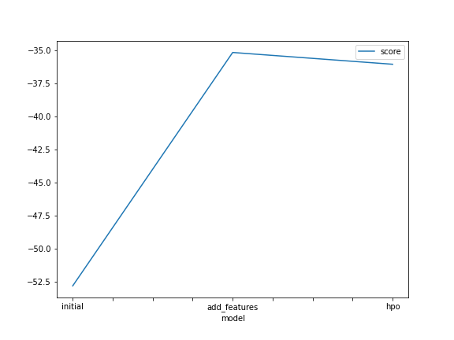
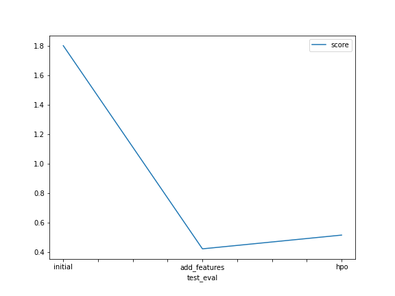

# Report: Predict Bike Sharing Demand with AutoGluon Solution
#### NAME HERE

## Initial Training
### What did you realize when you tried to submit your predictions? What changes were needed to the output of the predictor to submit your results?
that the 1st score is not good as i expected and the data needs a lot of data cleaning and preprocessing, i checked if there is any negative values but i found no negative values in the first model (Predictor) and the second model (predictor_new_features) while there was negative values in the last model (predictor_new_hpo) where i tuned some hyperparameter

### What was the top ranked model that performed?
the second one, the one with new feature and its name is predictor_new_features 

## Exploratory data analysis and feature creation
### What did the exploratory analysis find and how did you add additional features?
i changed the data types of columns to an appropriate types and created new columns like the month, day, hour

### How much better did your model preform after adding additional features and why do you think that is?
much better from 1.8 to 0.4

## Hyper parameter tuning
### How much better did your model preform after trying different hyper parameters?
it became much better than the first but a bit worth than the second

### If you were given more time with this dataset, where do you think you would spend more time?
i would look more for what i can do to make the score better like i would try to standarize or normalize the data

### Create a table with the models you ran, the hyperparameters modified, and the kaggle score.
|model|time limit|presets|num_trials|score|
|--|--|--|--|--|
|initial|600|best quality|nan|1.8|
|add_features|600|best quality|nan|0.4|
|hpo|600|best quality|5|0.5|

### Create a line plot showing the top model score for the three (or more) training runs during the project.

TODO: Replace the image below with your own.

### Create a line plot showing the top kaggle score for the three (or more) prediction submissions during the project.

TODO: Replace the image below with your own.

## Summary
cleaning data helps a lot in the performance of the machine learning models